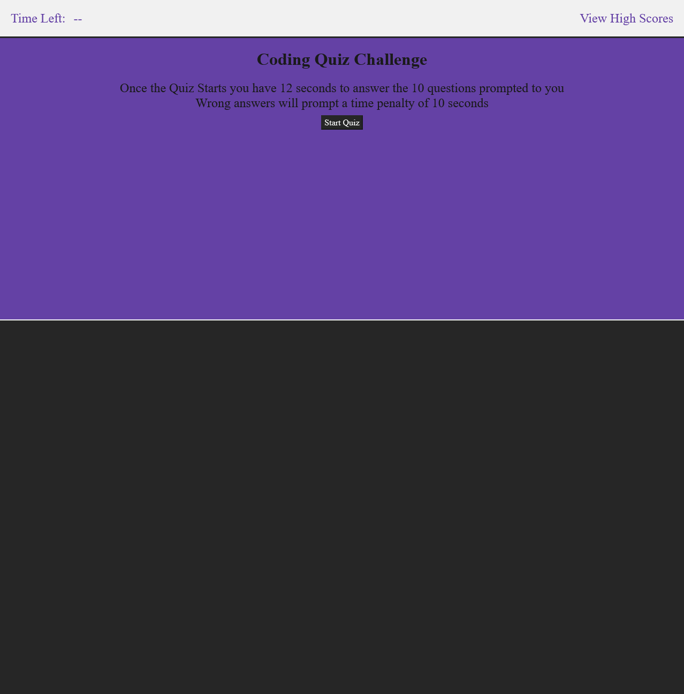

# coding-Quiz-Application

## About

This is a Front-End Only Single Page Website for Use as a ` Coding Quiz ` 

## Table of Contents

- [coding-Quiz-Application](#coding-quiz-application)
  - [About](#about)
  - [Table of Contents](#table-of-contents)
  - [Description](#description)
  - [Preview](#preview)
  - [Deployment](#deployment)
  - [Installation](#installation)
  - [Tests](#tests)
  - [License](#license)

## Description

This ` Coding Quiz App ` is a Static Single Page application that would empower teachers and content providers to test the knowledge of their students in an online interactive way. No Outside Api's are used so this could be used to study even when the powers out! This application was developed to get a better understanding of Vanilla JavaScript DOM manipulation, This App could easily be rewritten to serve quizzes of any content type or even be turned into a dynamic quiz template.

## Preview

The following Image Shows the Landing Page of the Quiz:

        

## Deployment

The application [Coding-Quiz](https://chriseligirard.github.io/coding-Quiz-Application/) is deployed with Github-Pages
  
## Installation

The Application is Deployed although you are able to install it locally and mess with the application yourself.

1. To get Started you will need to Clone The Repo Down
2. Once you are done editing if you were that is then simply right click on the html and open it in your prefered browser
3. Have Fun!!!

## Tests
  
  N/A
  
## License

